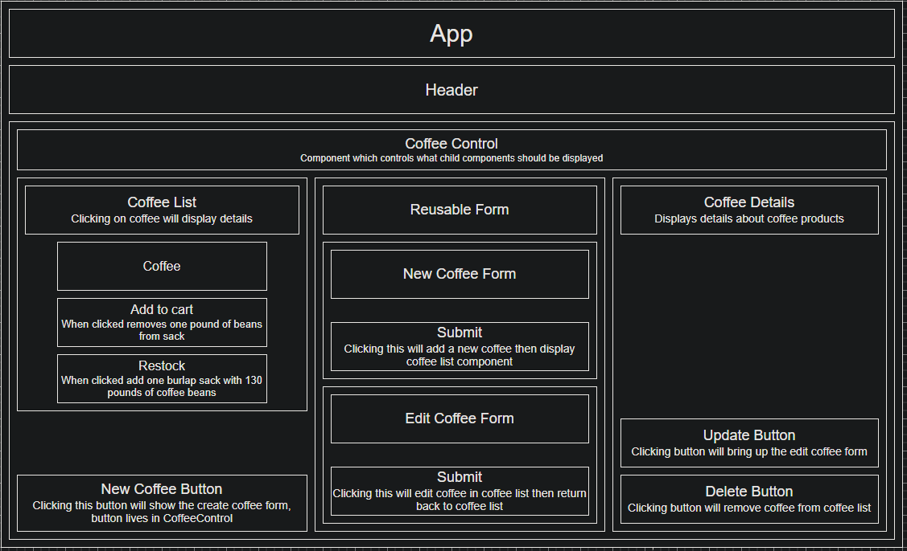

# Coffee Shop

#### A fidgetech independent project

#### By Jason Falk

## Technologies Used

* _Html_
* _Javascript_
* _React_
* _Git/Git Bash_
* _Bootstrap_

## Description

Welcome to the coffee shop where you can buy coffee. Create/read/edit/delete different coffee. You can set the name, origin, roast, price and total weight of all coffee in storage. It can even do online purchases (disclaimer: can not actually do online purchases).

## Setup/Installation Requirements

1. _In Git Bash type or copy/paste `git clone https://github.com/JasoFal/coffee_shop.git`._
2. _Navigate to directory project was cloned to using git bash using the cd command/file explorer/any other way._
-----
3. _Install all packages with <mark>$ npm install<mark>_
4. _Build project using webpack with <mark>$ npm run build<mark>_
5. _Start dev server with <mark>$ npm run start<mark>_

-------
_Optional_

* _Linting JS files in the <mark>src<mark> folder with <mark>$ npm run lint<mark>_

## Known Bugs

* _No bugs currently found_

## License

MIT

Copyright (c) 9/30/2024 Jason Falk

Permission is hereby granted, free of charge, to any person obtaining a copy
of this software and associated documentation files (the "Software"), to deal
in the Software without restriction, including without limitation the rights
to use, copy, modify, merge, publish, distribute, sublicense, and/or sell
copies of the Software, and to permit persons to whom the Software is
furnished to do so, subject to the following conditions:

The above copyright notice and this permission notice shall be included in all
copies or substantial portions of the Software.

THE SOFTWARE IS PROVIDED "AS IS", WITHOUT WARRANTY OF ANY KIND, EXPRESS OR
IMPLIED, INCLUDING BUT NOT LIMITED TO THE WARRANTIES OF MERCHANTABILITY,
FITNESS FOR A PARTICULAR PURPOSE AND NONINFRINGEMENT. IN NO EVENT SHALL THE
AUTHORS OR COPYRIGHT HOLDERS BE LIABLE FOR ANY CLAIM, DAMAGES OR OTHER
LIABILITY, WHETHER IN AN ACTION OF CONTRACT, TORT OR OTHERWISE, ARISING FROM,
OUT OF OR IN CONNECTION WITH THE SOFTWARE OR THE USE OR OTHER DEALINGS IN THE
SOFTWARE.

## Available Scripts

In the project directory, you can run:

### `npm start`

Runs the app in the development mode.\
Open [http://localhost:3000](http://localhost:3000) to view it in your browser.

The page will reload when you make changes.\
You may also see any lint errors in the console.

### `npm run build`

Builds the app for production to the `build` folder.\
It correctly bundles React in production mode and optimizes the build for the best performance.